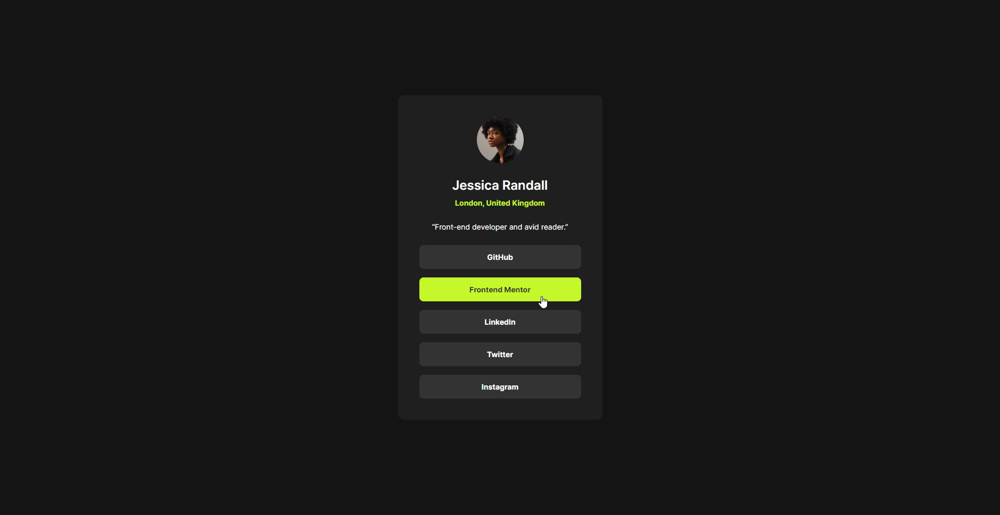
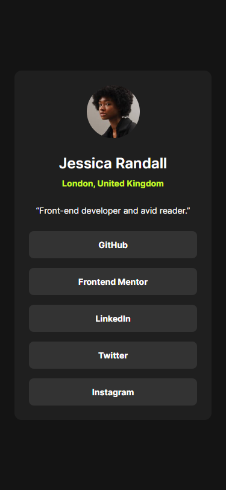

# Frontend Mentor - Social links profile solution

This is a solution to the [Social links profile challenge on Frontend Mentor](https://www.frontendmentor.io/challenges/social-links-profile-UG32l9m6dQ). Frontend Mentor challenges help you improve your coding skills by building realistic projects. 

## Table of contents

- [Overview](#overview)
  - [The challenge](#the-challenge)
  - [Screenshot](#screenshot)
  - [Links](#links)
- [My process](#my-process)
  - [Built with](#built-with)
  - [What I learned](#what-i-learned)
  - [Useful resources](#useful-resources)

## Overview

### The challenge

Users should be able to:

- See hover and focus states for all interactive elements on the page

### Screenshot

Desktop:

Mobile:

### Links

- Live site: [Add live site URL here](https://your-live-site-url.com)
- Challenge solution: [Add solution URL here](https://your-solution-url.com)

## My process

### Built with

- Vue
- SCSS
- Semantic HTML5 markup
- Accessibility
- Mobile-first workflow
- Custom CSS properties
- CSS Grid

### What I learned

I made the card responsive by using a media query and by using fluid design.
The card's width automatically adapts to the viewport on mobile screen sizes.

I also used the `<q>` tag to create the quote.

### Useful resources

- [Unfamiliar CSS patterns that improve on the classics - YouTube](https://www.youtube.com/watch?v=OtqZKLdDNXY) - How I created the `max-width-wrapper` class to make the card responsive.
- [Get your stylesheets more organized with Sass partials - YouTube](https://www.youtube.com/watch?v=9Ld-aOKsEDk) - My SCSS folder structure is inspired by this video.
